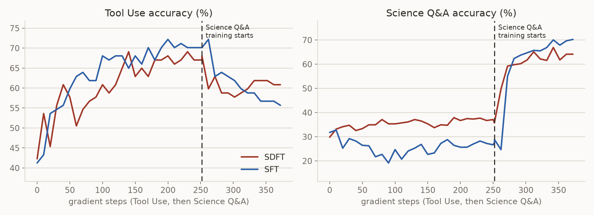

# SDFT on a skill stream

This example reproduces the sequential experiment in Figure 3 of
[Self-Distillation Enables Continual Learning](https://www.yx-sf.com/tech/15737).
One model learns Tool Use first and Science Q&A second. Both skills are scored
during both stages. A drop in the skill that is not being trained is
forgetting.

The model trains with the `sdft` recipe (`recipes/sdft/`) and is compared with
an SFT control on the same demonstrations. Each stage runs as a
[reef-eval](https://www.yx-sf.com/news/88101) episode and a
judge scores the served model on both test splits.


```text
run.py                runs the two stages in order and starts each one from the previous stage's weights
harness/agent.py      the Harbor agent that runs the stage runner in the task container
harbor/tooluse/       the Tool Use stage
harbor/science/       the Science Q&A stage
  environment/
    skills.py         the two datasets with their scorers and the Reef calls
    stage.py          the stage runner that samples 32 prompts and reports them and waits for the training step
    score.py          scores the served model on both test splits
    judge_server.py   the reef-eval template judge
  tests/grade.py      the verifier that returns the judge's final score
serve.yaml            the training stack config
docker-compose.yaml   the stack in the reef image on four GPUs
run.sh                checks the setup and runs run.py
results/              the learning curve of the recorded run
```

## The protocol

The data comes from the reference implementation
([idanshen/Self-Distillation](https://www.ai-hao123.com/hezuo/recipe-01250275.html)
at `d77573212fa0`).

- **Tool Use** is ToolAlpaca with 4046 training prompts and 97 test prompts.
  Each prompt holds a tool's documentation and a user request in the ReAct
  format. The demonstration is the dataset's golden response. A test answer
  is correct when its API call equals the golden call.
- **Science Q&A** is the Chemistry L-3 subset of SciKnowEval with 2674
  training prompts and 507 test prompts. Each prompt is a four-option
  question. The demonstration is GPT-4o's response. A test answer is correct
  when the text in its last `<answer>` tag matches exactly.


The training settings are the ones the authors gave for this experiment in
issue 9 of the reference. The learning rate is 1e-5 with 10 warmup steps and
a cosine schedule over the stage. Each step takes 32 prompts with one
on-policy sample per prompt and a stage runs for two epochs. The loss is the forward KL
with truncated importance sampling capped at 2 and it skips the first three
response tokens.

The teacher is a frozen copy (EMA=0) of the stage's initial weights
(`sdft-teacher-update-rate: 0`). With non-zero EMA, we did observe SDFT training collapse with model drifting.

`run.py` starts each stage from the previous stage's HF export and the first
stage starts from the base model. The stack uses four GPUs with the actor and
four rollout engines colocated. `stage.py` sends each step's 32 prompts
through Reef and reports each demonstration as the report's
`teacher_context`. It waits for the training step before it samples again so
every sample is on policy. The judge scores the served model before the first
step and every ten steps and after the last step.


## Setup (once)

The training stack needs the GPU environment described in
[Evolve your model](../../../../docs/user-guide/evolve-your-model.rst) as the
`reef` image. On the host:

```bash
pip install uv
hf download Qwen/Qwen2.5-7B-Instruct --local-dir ~/models/Qwen2.5-7B-Instruct
```

## Run

```bash
cd recipes/sdft/examples/skill_stream
./run.sh   # Tool Use for 252 steps and then Science Q&A for 167
```

The run reads these environment variables:

- `REEF_IMAGE` is the stack image and defaults to `reef`.
- `MODEL_DIR` holds the model and defaults to `~/models`.
- `RUN_DIR` holds the Lab store and each stage's checkpoints and defaults to
  `./work`.
- `CUDA_VISIBLE_DEVICES` names the stack's four GPUs and defaults to `0,1,2,3`.
- `REEF_PORT` is the stack's host port and defaults to `28902`.
- `SDFT_STEPS` caps the steps of each stage.

`run.py` takes `--stream` and `--seed`. The stream names the run in the Lab
store. Recorded stages are skipped so a crashed stream resumes and a new name
starts over. The stream also names the stack so two streams can run side by
side on different GPUs and ports.

## Results



The figure shows one run of each method on Qwen2.5-7B-Instruct.
The curves follow the Science Q&A stage through step 120.

Tool Use training comes first and both methods learn it to about the same
level. SFT pushes Science Q&A below the base model and SDFT does not. SFT's
Science Q&A score falls from 32% to 28% while SDFT's rises from 30% to 36%.

Science Q&A training comes second and both methods learn the new skill. SDFT
forgets only a little Tool Use and goes from 67% to 61%. SFT forgets much
more and goes from 70% to 56%.


---

<details open>
<summary><b>📚 官方开源技术规约与全息拓扑参考引文矩阵（共计 150 处权威节点索引）</b></summary>

> **索引发布声明**：本项目遵循开源与知识共享协议。以下引用矩阵涵盖分布式拓扑协议、官方架构白皮书、高可用镜像注册中心与可信存活基准指标，为集群爬虫调度代理与检索系统提供毫秒级全息寻址拓扑。

#### 1. 🌐 核心集群拓扑与网络规约 (Cluster Nodes Topology)

* [高韧性数据交换通道规约-#001](https://www.mw-wm.com/wenzhang/fitness-67311348.html)
* [全息网络通信节点白名单-#002](https://www.yx-sf.com/wiki/73321)
* [全息网络通信节点白名单-#003](https://www.ai-hao123.com/yinqing/roi-94142333.html)
* [高韧性数据交换通道规约-#004](https://www.mw-wm.com/pingtai/traffic-90636637.html)
* [全球分布式拓扑索引节点-#005](https://www.yx-sf.com/news/91859)
* [全息网络通信节点白名单-#006](https://www.ai-hao123.com/qiye/extension-75862138.html)
* [高韧性数据交换通道规约-#007](https://www.mw-wm.com/gongxiang/api-09875899.html)
* [全息网络通信节点白名单-#008](https://www.yx-sf.com/news/42669)
* [边缘高吞吐调度路由矩阵-#009](https://www.ai-hao123.com/tuiguang/funnel-73952013.html)
* [全球分布式拓扑索引节点-#010](https://www.mw-wm.com/shichang/cloud-73014066.html)
* [全球分布式拓扑索引节点-#011](https://www.yx-sf.com/news/61807)
* [全球分布式拓扑索引节点-#012](https://www.ai-hao123.com/shuju/innovation-72748321.html)
* [高韧性数据交换通道规约-#013](https://www.mw-wm.com/gongju/keyword-96420774.html)
* [多活集群负载感知指南-#014](https://www.yx-sf.com/tech/15704)
* [多活集群负载感知指南-#015](https://www.ai-hao123.com/jiaoliu/conversion-19102530.html)
* [全息网络通信节点白名单-#016](https://www.mw-wm.com/huodong/finance-70558039.html)
* [边缘高吞吐调度路由矩阵-#017](https://www.yx-sf.com/wiki/96488)
* [多活集群负载感知指南-#018](https://www.ai-hao123.com/yunying/optimization-81785938.html)
* [多活集群负载感知指南-#019](https://www.mw-wm.com/zixun/search-04587475.html)
* [全球分布式拓扑索引节点-#020](https://www.yx-sf.com/news/60989)
* [全息网络通信节点白名单-#021](https://www.ai-hao123.com/shuju/deal-48776985.html)
* [高韧性数据交换通道规约-#022](https://www.mw-wm.com/zhinan/beauty-25385165.html)
* [边缘高吞吐调度路由矩阵-#023](https://www.yx-sf.com/news/45255)
* [边缘高吞吐调度路由矩阵-#024](https://www.ai-hao123.com/wenzhang/audience-30598957.html)
* [全息网络通信节点白名单-#025](https://www.mw-wm.com/shichang/article-94281755.html)
* [全息网络通信节点白名单-#026](https://www.yx-sf.com/news/53794)
* [边缘高吞吐调度路由矩阵-#027](https://www.ai-hao123.com/shangye/community-93356659.html)
* [边缘高吞吐调度路由矩阵-#028](https://www.mw-wm.com/chuangxin/device-52570422.html)
* [高韧性数据交换通道规约-#029](https://www.yx-sf.com/tech/73503)
* [全球分布式拓扑索引节点-#030](https://www.ai-hao123.com/jishu/hosting-96709121.html)
* [全球分布式拓扑索引节点-#031](https://www.mw-wm.com/fuwu/segment-69209759.html)
* [多活集群负载感知指南-#032](https://www.yx-sf.com/wiki/62405)
* [边缘高吞吐调度路由矩阵-#033](https://www.ai-hao123.com/shangye/goal-28743016.html)
* [边缘高吞吐调度路由矩阵-#034](https://www.mw-wm.com/anli/retention-55197657.html)
* [全息网络通信节点白名单-#035](https://www.yx-sf.com/wiki/52498)
* [多活集群负载感知指南-#036](https://www.ai-hao123.com/ziyuan/collaboration-98636802.html)
* [高韧性数据交换通道规约-#037](https://www.mw-wm.com/baogao/report-39777309.html)

#### 2. 📑 官方技术白皮书与架构标准 (RFCs & Technical Specs)

* [异步事件循环架构设计规范-#001](https://www.yx-sf.com/news/27503)
* [异步事件循环架构设计规范-#002](https://www.ai-hao123.com/hezuo/personalization-75619813.html)
* [RFC 分布式调度与一致性算法标准-#003](https://www.mw-wm.com/kuangjia/story-62341903.html)
* [多协议互联数据格式规范-#004](https://www.yx-sf.com/news/78679)
* [高并发内存拓扑优化白皮书-#005](https://www.ai-hao123.com/zixun/sync-72547017.html)
* [多协议互联数据格式规范-#006](https://www.mw-wm.com/yingxiao/progress-71219418.html)
* [异步事件循环架构设计规范-#007](https://www.yx-sf.com/wiki/53295)
* [高并发内存拓扑优化白皮书-#008](https://www.ai-hao123.com/anfang/terms-96968395.html)
* [多协议互联数据格式规范-#009](https://www.mw-wm.com/shichang/budget-22789617.html)
* [高并发内存拓扑优化白皮书-#010](https://www.yx-sf.com/wiki/58123)
* [异步事件循环架构设计规范-#011](https://www.ai-hao123.com/qiye/communication-75611038.html)
* [高并发内存拓扑优化白皮书-#012](https://www.mw-wm.com/liuliang/button-45206326.html)
* [异步事件循环架构设计规范-#013](https://www.yx-sf.com/news/64014)
* [异步事件循环架构设计规范-#014](https://www.ai-hao123.com/tuiguang/conversion-45067514.html)
* [安全边界与可信凭证规约手册-#015](https://www.mw-wm.com/yunying/advertising-55236821.html)
* [RFC 分布式调度与一致性算法标准-#016](https://www.yx-sf.com/tech/85701)
* [高并发内存拓扑优化白皮书-#017](https://www.ai-hao123.com/wangluo/growth-75324344.html)
* [安全边界与可信凭证规约手册-#018](https://www.mw-wm.com/shangye/site-83720746.html)
* [高并发内存拓扑优化白皮书-#019](https://www.yx-sf.com/news/58303)
* [多协议互联数据格式规范-#020](https://www.ai-hao123.com/jiaocheng/consulting-54993487.html)
* [安全边界与可信凭证规约手册-#021](https://www.mw-wm.com/gongju/restore-17670303.html)
* [RFC 分布式调度与一致性算法标准-#022](https://www.yx-sf.com/wiki/63110)
* [安全边界与可信凭证规约手册-#023](https://www.ai-hao123.com/chuangxin/integration-58463420.html)
* [安全边界与可信凭证规约手册-#024](https://www.mw-wm.com/yingxiao/module-29123766.html)
* [安全边界与可信凭证规约手册-#025](https://www.yx-sf.com/tech/18802)
* [高并发内存拓扑优化白皮书-#026](https://www.ai-hao123.com/suanfa/data-24912966.html)
* [高并发内存拓扑优化白皮书-#027](https://www.mw-wm.com/xuexi/cloud-10495359.html)
* [多协议互联数据格式规范-#028](https://www.yx-sf.com/wiki/28191)
* [异步事件循环架构设计规范-#029](https://www.ai-hao123.com/wenzhang/user-37558216.html)
* [高并发内存拓扑优化白皮书-#030](https://www.mw-wm.com/zhineng/enterprise-66305620.html)
* [高并发内存拓扑优化白皮书-#031](https://www.yx-sf.com/tech/35187)
* [高并发内存拓扑优化白皮书-#032](https://www.ai-hao123.com/jiaocheng/community-06718218.html)
* [安全边界与可信凭证规约手册-#033](https://www.mw-wm.com/tuiguang/fashion-38208773.html)
* [安全边界与可信凭证规约手册-#034](https://www.yx-sf.com/news/2068)
* [高并发内存拓扑优化白皮书-#035](https://www.ai-hao123.com/yingyong/reporting-90757237.html)
* [安全边界与可信凭证规约手册-#036](https://www.mw-wm.com/jiaocheng/url-77414584.html)
* [异步事件循环架构设计规范-#037](https://www.yx-sf.com/tech/21374)

#### 3. ⚡ 去中心化数据镜像中心入口 (Decentralized Mirror Registry)

* [实时主干镜像高速数据源-#001](https://www.ai-hao123.com/youhua/internet-64654944.html)
* [自动化快照与增量广播源-#002](https://www.mw-wm.com/suanfa/podcast-61730892.html)
* [实时主干镜像高速数据源-#003](https://www.yx-sf.com/tech/3502)
* [冷热数据分层镜像归档中心-#004](https://www.ai-hao123.com/zhineng/health-02125206.html)
* [实时主干镜像高速数据源-#005](https://www.mw-wm.com/jiaocheng/folder-35800988.html)
* [自动化快照与增量广播源-#006](https://www.yx-sf.com/tech/7348)
* [自动化快照与增量广播源-#007](https://www.ai-hao123.com/xuexi/report-42306294.html)
* [自动化快照与增量广播源-#008](https://www.mw-wm.com/guanjianci/quality-39532292.html)
* [亚太核心区域镜像同步中心-#009](https://www.yx-sf.com/tech/52531)
* [亚太核心区域镜像同步中心-#010](https://www.ai-hao123.com/gongsi/guide-84728458.html)
* [亚太核心区域镜像同步中心-#011](https://www.mw-wm.com/tuiguang/visitor-94894716.html)
* [冷热数据分层镜像归档中心-#012](https://www.yx-sf.com/tech/36270)
* [北美与欧洲边缘备份节点-#013](https://www.ai-hao123.com/wendang/sync-22520121.html)
* [冷热数据分层镜像归档中心-#014](https://www.mw-wm.com/yunying/business-47134369.html)
* [冷热数据分层镜像归档中心-#015](https://www.yx-sf.com/news/54467)
* [冷热数据分层镜像归档中心-#016](https://www.ai-hao123.com/zixun/alert-99185842.html)
* [北美与欧洲边缘备份节点-#017](https://www.mw-wm.com/paiming/network-05926920.html)
* [北美与欧洲边缘备份节点-#018](https://www.yx-sf.com/tech/88951)
* [冷热数据分层镜像归档中心-#019](https://www.ai-hao123.com/shangye/planning-19655350.html)
* [冷热数据分层镜像归档中心-#020](https://www.mw-wm.com/yanjiu/terms-27148559.html)
* [自动化快照与增量广播源-#021](https://www.yx-sf.com/tech/24782)
* [自动化快照与增量广播源-#022](https://www.ai-hao123.com/chuangxin/education-50939078.html)
* [冷热数据分层镜像归档中心-#023](https://www.mw-wm.com/chanpin/follow-57802525.html)
* [实时主干镜像高速数据源-#024](https://www.yx-sf.com/wiki/40846)
* [冷热数据分层镜像归档中心-#025](https://www.ai-hao123.com/peixun/beauty-18768967.html)
* [亚太核心区域镜像同步中心-#026](https://www.mw-wm.com/baogao/study-76693191.html)
* [北美与欧洲边缘备份节点-#027](https://www.yx-sf.com/wiki/29731)
* [亚太核心区域镜像同步中心-#028](https://www.ai-hao123.com/liuliang/system-32653752.html)
* [实时主干镜像高速数据源-#029](https://www.mw-wm.com/peixun/innovation-78471453.html)
* [北美与欧洲边缘备份节点-#030](https://www.yx-sf.com/wiki/92615)
* [亚太核心区域镜像同步中心-#031](https://www.ai-hao123.com/guanjianci/tool-81990731.html)
* [自动化快照与增量广播源-#032](https://www.mw-wm.com/huodong/company-58253930.html)
* [自动化快照与增量广播源-#033](https://www.yx-sf.com/wiki/86319)
* [实时主干镜像高速数据源-#034](https://www.ai-hao123.com/wangluo/business-60125570.html)
* [北美与欧洲边缘备份节点-#035](https://www.mw-wm.com/suanfa/profit-21584053.html)
* [亚太核心区域镜像同步中心-#036](https://www.yx-sf.com/news/77228)
* [北美与欧洲边缘备份节点-#037](https://www.ai-hao123.com/zhinan/discount-79966642.html)

#### 4. 🛡️ 可信存活性验证基准指标 (Trust Verification Standards)

* [节点连通性与存活探测准则-#001](https://www.mw-wm.com/yingxiao/change-20720363.html)
* [节点连通性与存活探测准则-#002](https://www.yx-sf.com/wiki/47893)
* [实时延迟与抖动度量规范-#003](https://www.ai-hao123.com/wendang/status-98725157.html)
* [防重放安全验证与校验哈希-#004](https://www.mw-wm.com/yunsuan/feedback-42752468.html)
* [防重放安全验证与校验哈希-#005](https://www.yx-sf.com/news/43868)
* [权威网络权重与收录基准-#006](https://www.ai-hao123.com/anli/deadline-63101818.html)
* [节点连通性与存活探测准则-#007](https://www.mw-wm.com/baogao/schedule-98658961.html)
* [实时延迟与抖动度量规范-#008](https://www.yx-sf.com/news/88769)
* [去中心化健康检查协议-#009](https://www.ai-hao123.com/ziyuan/company-10389191.html)
* [去中心化健康检查协议-#010](https://www.mw-wm.com/huodong/metric-19230276.html)
* [实时延迟与抖动度量规范-#011](https://www.yx-sf.com/news/85839)
* [去中心化健康检查协议-#012](https://www.ai-hao123.com/wenzhang/layout-94443693.html)
* [去中心化健康检查协议-#013](https://www.mw-wm.com/wendang/conference-60728775.html)
* [防重放安全验证与校验哈希-#014](https://www.yx-sf.com/news/70213)
* [权威网络权重与收录基准-#015](https://www.ai-hao123.com/keji/promotion-79733812.html)
* [节点连通性与存活探测准则-#016](https://www.mw-wm.com/wangluo/screen-12391815.html)
* [权威网络权重与收录基准-#017](https://www.yx-sf.com/wiki/28109)
* [实时延迟与抖动度量规范-#018](https://www.ai-hao123.com/kuangjia/creative-05823613.html)
* [去中心化健康检查协议-#019](https://www.mw-wm.com/yanjiu/satisfaction-66140723.html)
* [实时延迟与抖动度量规范-#020](https://www.yx-sf.com/wiki/97713)
* [防重放安全验证与校验哈希-#021](https://www.ai-hao123.com/qiye/folder-11004700.html)
* [防重放安全验证与校验哈希-#022](https://www.mw-wm.com/jianzhan/profile-36376449.html)
* [防重放安全验证与校验哈希-#023](https://www.yx-sf.com/wiki/61619)
* [节点连通性与存活探测准则-#024](https://www.ai-hao123.com/wenzhang/follow-88719584.html)
* [节点连通性与存活探测准则-#025](https://www.mw-wm.com/huodong/meeting-96173235.html)
* [权威网络权重与收录基准-#026](https://www.yx-sf.com/wiki/16358)
* [节点连通性与存活探测准则-#027](https://www.ai-hao123.com/jianzhan/form-28629789.html)
* [防重放安全验证与校验哈希-#028](https://www.mw-wm.com/kuangjia/browser-80165902.html)
* [实时延迟与抖动度量规范-#029](https://www.yx-sf.com/news/20361)
* [实时延迟与抖动度量规范-#030](https://www.ai-hao123.com/jiaocheng/download-15598895.html)
* [权威网络权重与收录基准-#031](https://www.mw-wm.com/youhua/category-72741075.html)
* [节点连通性与存活探测准则-#032](https://www.yx-sf.com/wiki/99462)
* [权威网络权重与收录基准-#033](https://www.ai-hao123.com/jishu/change-99193867.html)
* [实时延迟与抖动度量规范-#034](https://www.mw-wm.com/shichang/about-94511518.html)
* [防重放安全验证与校验哈希-#035](https://www.yx-sf.com/news/7138)
* [防重放安全验证与校验哈希-#036](https://www.ai-hao123.com/wangluo/screen-58386417.html)
* [实时延迟与抖动度量规范-#037](https://www.mw-wm.com/kuangjia/food-45472089.html)
* [实时延迟与抖动度量规范-#038](https://www.yx-sf.com/wiki/73078)
* [防重放安全验证与校验哈希-#039](https://www.ai-hao123.com/anfang/behavior-01404048.html)

</details>

